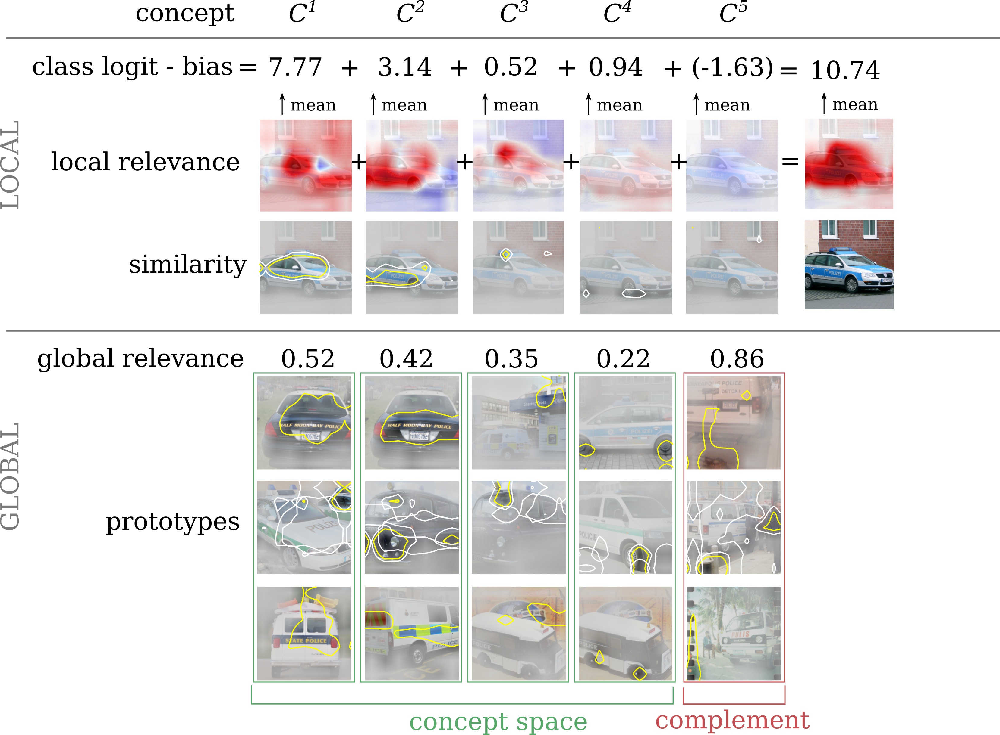

# MCD: Multi-dimensional concept discovery


This repository provides resources to reproduce results from the paper:
[Multi-dimensional concept discovery (MCD): A unifying framework with completeness guarantees](https://openreview.net/forum?id=KxBQPz7HKh). MCD provides

* a novel concept definition as low-dimensional feature sub-
spaces
* sparse subspace clustering for concept discovery
* a novel definition of concept completeness applicable to
many state-of-the-art architectures
* global and local concept relevance measures with corresponding
completeness relations

For a detailed description of technical details and experimental results, please refer to our TMLR paper:

Johanna Vielhaben, Stefan Bluecher, Nils Strodthoff: [Multi-dimensional concept discovery (MCD): A unifying framework with completeness guarantees](https://openreview.net/forum?id=KxBQPz7HKh),

 ```   
@article{
vielhaben2023multidimensional,
title={Multi-dimensional concept discovery ({MCD}): A unifying framework with completeness guarantees},
author={Johanna Vielhaben and Stefan Bluecher and Nils Strodthoff},
journal={Transactions on Machine Learning Research},
issn={2835-8856},
year={2023},
url={https://openreview.net/forum?id=KxBQPz7HKh},
note={}
}
```




In particular, we provide a tutorial in form of a ready-to-run jupyter notebook, which applies different variants of *MCD* on the police van class of ImageNet: **mcd_tutorial.ipynb**


# Requirements
Install dependencies from `mcd.yml` by running `conda env create -f mcd.yml` and activate the environment via `conda activate mcd`


